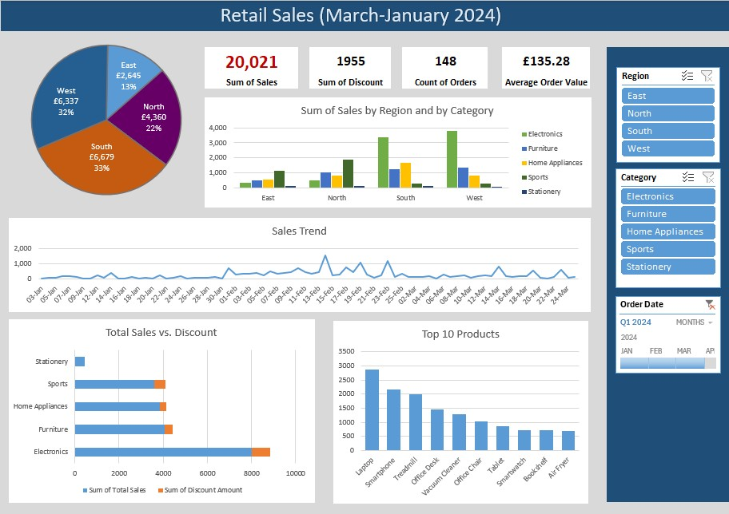

# retail-sales-dashboard-excel

This project analyses 3 months of retail sales data using Excel.  
It includes KPI cards, interactive slicers, Pivot Tables, and visual dashboards.

## Key Features
- Total Sales, Sales by Region, Sales by Category
- Daily sales trend analysis
- Top 10 products by revenue
- Region-based performance with slicers
- Clean, professional dashboard layout

## Files Included
- `retail_sales_report.xlsx` – main Excel dashboard
- `retail_sales` – raw datasets (Jan–Mar 2024)
- `retail_sales_report_all_categories` – dashboard preview images
- `retail_sales_report_furniture` – dashboard preview images

## Skills Demonstrated
- Advanced Excel (Power Query Editor, Excel Functions, Pivot Tables, charts, slicers)
- Data cleaning and preparation
- Dashboard design 
- Retail analytics

## Preview

